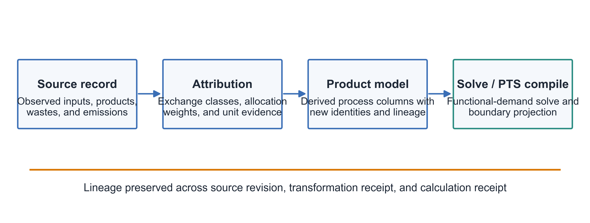

**Affiliation.** Independent Researcher, China

**Corresponding author.** Jiaqi Lu, wilsherelu@foxmail.com

## Highlights

- Separates observed multi-output production facts from allocation-dependent product models.
- Defines explicit product attribution with exchange classification, unit evidence, and closure.
- Compiles an internal PTS into product-specific boundary and elementary-flow operators.
- Proves model-level boundary-operator equivalence under stated linear assumptions.
- Demonstrates the implementation through five progressive API-executed projects and an independent matrix oracle.

# 1. Introduction

Industrial data collection and product LCA answer different questions. Plant records, production logs, engineering balances, and environmental reports commonly describe what occurred within a physical or organizational boundary during a batch or reporting period. They contain total inputs, direct emissions, waste transfers, and several products or by-products. Product LCA selects one reference product and functional demand, attributes shared exchanges to that product or applies another multifunctionality treatment, and connects the resulting inventory to upstream and downstream providers. The scientific problem is therefore not merely whether a software package can store multiple outputs. It is how observed production facts, product-attribution choices, calculated process columns, and reusable subsystem representations can remain distinct, reproducible, and mutually traceable.

ISO 14040 and ISO 14044 define the general LCA framework and requirements, including the treatment of multifunctional processes [1,2]. The ILCD Handbook provides detailed technical guidance and a structured data model, while the ILCD Data Network document defines rules for UUIDs and dataset versions [3,4]. Global guidance for LCA databases likewise emphasizes consistent documentation and dataset management [24]. The TianGong database has recently been documented as an open-source, ILCD entry-level life-cycle unit-process database for China [25], while TIDAS exposes structured contracts for processes, flows, flow properties, unit groups, models, and their dependencies [5]. These specifications are necessary for data exchange and identity management, but a syntactically valid package does not determine a multifunctionality choice, guarantee a stable numerical interpretation after transformation, or prove equivalence between an expanded network and an aggregated artifact.

The underlying mathematical machinery is also established. Matrix formulations of process-based LCA express a functional demand through a technology matrix and propagate the solved activities to elementary flows and impact indicators [6]. Multifunctionality has been examined through physical, economic, causal, substitution, and system-expansion approaches, and reviews show substantial variation in practical implementation [7-9]. Existing LCA software supports allocation, product systems, and system-process aggregation. Brightway implements graph-to-matrix representations with explicit process and product nodes [10-12], while openLCA supports several allocation methods and fully or partially terminated system processes [13,14]. Database and software communities have likewise examined data transparency, model revision, disclosure, and privacy-preserving aggregation [15-21]. The present work therefore does not claim to invent allocation, matrix LCA, aggregation, process-product graphs, modular modeling, or confidentiality-preserving computation.

The narrower gap addressed here is the transformation contract connecting these established elements. For a multi-output industrial system, can total-process facts be recorded once; can product-resolved process columns be generated deterministically from explicit attribution evidence; and can an internal product technology system be compiled into a reusable boundary representation whose quantities, elementary flows, and impacts are demonstrably the same as those of the expanded subsystem? Can these transformations retain continuous provenance without assigning source identifiers to semantically new objects? Finally, can claims be limited by predefined numerical and semantic oracles rather than by the fact that a software artifact runs?

This paper answers those questions through a formal method and an executed progressive benchmark. Its central contribution is a traceable compilation chain from a multi-output total-process inventory to a product-resolved boundary model. The contribution comprises four linked elements:

1. a dual representation that separates source production facts from product-resolved computational objects;
2. an explicit attribution transformation with exchange classification, unit evidence, and an accounting-closure identity;
3. a PTS compiler that eliminates internal dependencies and constructs product-specific boundary operators; and
4. an evidence contract that separates mathematical equivalence, implementation conformance, data round trips, and limited disclosure.

The manuscript also corrects a common semantic ambiguity. Equality between supplier and consumer quantities is meaningful for two records that describe the same realized transfer in a shared batch or reporting period. It is not generally required between normalized LCA coefficients. In a computational product system, provider and consumer coefficients can differ because process activities are scaled by solving $Tx=f$. Structural compatibility is checked through flow identity, flow property, unit group, and declared conversions; quantity closure is checked on activity-scaled exchanges and system residuals.

The remainder of the paper first positions the proposed contribution against established methods and software. It then defines the source, attribution, computational, and provenance objects; presents the full-system and PTS mathematics; proves model-level boundary-operator equivalence; specifies numerical and fail-closed conditions; and reports five progressively composed benchmark projects. The results distinguish the equivalence demonstrated for one tested demand from the stronger, still unverified claim of basis-complete implementation equivalence.

# 2. Related work and contribution boundaries

## 2.1. Multifunctionality and allocation

ISO 14044 requires multifunctionality to be addressed systematically and distinguishes avoidance of allocation, physical relationships, and other relationships where physical partitioning cannot be established [2]. In practice, the hierarchy is interpreted and implemented in different ways. Reviews of multifunctionality practice document variation in system subdivision, substitution, physical allocation, economic allocation, and the framing of the decision problem [7,8]. Economic allocation in particular depends not only on a numerical price ratio but also on geography, market stage, time basis, currency, taxes, treatment of negative-value outputs, and price variability [9].

The framework developed here does not prescribe one universally preferred multifunctionality rule. It requires the selected rule to be represented as a versioned transformation with explicit evidence. A mass, energy, quantity, economic, causal, manual, substitution, or system-expansion treatment may be used when it is appropriate to the goal and scope, but each has different semantics. The simple allocation equations in Section 4 apply only to exchanges declared subject to partitioning. Substitution, recycling, waste responsibility, and avoided-product exchanges require separate rules and are not silently folded into one scalar factor.

## 2.2. Data identity and exchange formats

The ILCD framework represents processes, flows, flow properties, unit groups, sources, contacts, and LCIA methods as referenced datasets [3]. Its UUID and version guidance explicitly addresses identity and version management for these object types [4]. TIDAS provides public documentation and machine-readable contracts for analogous LCA objects and dependencies [5]. These systems support interoperability, but interoperability must be decomposed into field-level questions: whether source identifiers and versions are retained, whether quantities and units are normalized, whether allocation metadata is representable, and whether a derived process receives a new identity with a link to its source.

The present method consequently uses the term *lineage-aware compilation*, not *identity-preserving compilation*. Imported source objects retain supported source identifiers. Product-resolved processes and PTS artifacts are new semantic objects and receive new identifiers. Continuity is provided by provenance records linking sources, transformation activities, parameters, unit conversions, boundary mappings, and outputs.

## 2.3. Matrix LCA and product-system representations

Matrix LCA represents a product system as a set of process activities connected by technical exchanges [6]. Brightway documents several graph representations, including separate process and product nodes and combined process-reference-product nodes, and constructs a signed technosphere matrix with production and consumption coefficients [10-12]. These representations already support flexible product systems and efficient sparse linear algebra. The present method uses the same general computational foundation. Its contribution lies in the controlled transformation from an industrial total-process record to the normalized columns used in the matrix, and from a selected internal subgraph to a product-specific boundary operator.

## 2.4. Aggregation, modularity, and disclosure

Process aggregation is established in LCA databases and software. The original ecoinvent framework described unit-process and aggregated inventory structures [15], and later database development separated raw data from modeling choices and system models [22]. openLCA distinguishes fully terminated system processes, which expose elementary flows, from partially terminated processes that retain selected intermediate flows for later provider linking [14]. Systematic disaggregation has also been proposed to recover interpretability from aggregated calculations [16].

Aggregation can reduce direct disclosure, but aggregation alone is not a privacy guarantee. Product-system disclosure frameworks have shown how foreground models can be partitioned into public and private components while preserving reproducibility under specified access assumptions [18]. Privacy-preserving aggregation has been studied under explicit cryptographic and adversarial models [19]. The PTS artifact introduced here may reduce visible topology and parameters, but this paper describes that property only as *limited disclosure*. A privacy claim would require a threat model, attack tasks, and leakage metrics that are outside the core method.

## 2.5. What is and is not claimed

Table 1 separates the contribution of this paper from established capabilities.

**Table 1. Contribution boundaries.**

| Area | Established basis | Contribution and explicit nonclaim |
|---|---|---|
| Multifunctionality | Allocation, substitution, subdivision, and system expansion are established [1,2,7-9,13] | Defines a source-to-product transformation with exchange classification, unit evidence, closure, and receipt; it does not prescribe a universally preferred rule. |
| Matrix calculation | Technology-matrix LCA and graph-to-matrix construction are established [6,10-12] | Provides consistent notation and a semantic bridge from source facts to process columns; it is not a new LCA solution paradigm. |
| Aggregation and modules | System processes, partial termination, and aggregation are established [14-16] | Defines product-specific PTS boundary operators linked to source and attribution lineage; it does not claim the first modular or aggregated LCA. |
| Interoperability | ILCD and TIDAS define structured objects and references [3-5] | Defines a field-level round-trip contract and distinct derived identities; it does not assume lossless support for every field. |
| Disclosure | Public/private partitions and privacy-preserving aggregation have been studied [18,19] | Defines a declared boundary release with utility and disclosure metrics; it makes no cryptographic privacy claim. |
| Reproducibility | Model-description, revision, and reporting frameworks exist [17,20,21] | Binds snapshots, matrices, receipts, residuals, failures, and figures in case manifests; reproducibility remains gated by publication of those artifacts. |

# 3. Semantic object model

## 3.1. Total-process source representation

A total-process source representation describes a declared physical or organizational boundary and a declared time or batch basis. For process $j$, it records total technical inputs, direct elementary flows, multiple product and by-product outputs, wastes, reference quantities, flow identities, units, and supporting evidence. *Unallocated* means that shared exchanges have not yet been partitioned among co-products. It does not mean that products are undefined, that allocation evidence is unavailable, or that an “unallocated product footprint” exists.

The source representation is intended to remain aligned with industrial evidence. A revised production record creates a new source revision and invalidates dependent transformations. A revised allocation basis creates a new product-resolved representation without rewriting the source facts. The distinction is analogous to separating observations from model choices: both are necessary, but they should not be maintained as one mutable object.

## 3.2. Attribution receipt and product-resolved representation

An attribution receipt binds one source-process revision to a target product and a complete set of transformation parameters. At minimum, it records:

- source process identifier and version;
- target product identifier, version, observed quantity, and reference unit;
- allocation or multifunctionality rule type;
- raw weights, common basis, and normalized factors;
- every cross-unit or cross-property conversion and its evidence;
- exchange-classification overrides;
- treatment of wastes, negative-value outputs, recycling, and substitution where applicable;
- transformation schema and implementation version; and
- source and result content hashes used to detect stale artifacts.

A product-resolved process is a derived computational object. It receives a new identifier and links to the source process and attribution receipt. The source process is not overwritten, and its identifier is not reused.

## 3.3. Exchange classes

A single scalar factor is not valid for every exchange in a multifunctional process. Exchanges are classified before transformation:

**Table 2. Default treatment by exchange class.**

| Exchange class | Default product-resolution treatment |
|---|---|
| Shared technical inputs and shared elementary flows | Partition using the declared attribution rule |
| Product-specific technical inputs and elementary flows | Assign only to the identified product line |
| Reference products and co-product outputs | Define product quantities and references; do not mechanically treat them as burdens |
| Internal intermediate flows | Retain for system solution; cancel only when they close inside a compiled boundary |
| Wastes and negative-value outputs | Apply an explicit responsibility, treatment, or allocation rule |
| Substitution and system-expansion exchanges | Apply a separately declared counterfactual rule |
| Nonallocable control exchanges | Retain or reject according to their explicit semantics |

The classification itself is part of the receipt. An exchange with missing classification is not automatically assumed to be shared when that assumption could affect a product result.

## 3.4. Two different quantity semantics

The framework distinguishes source-state quantity auditing from computational closure (Figure 2).

A *source-state transfer audit* applies when two records describe the same realized transfer within a common batch or reporting period. If the supplier records $Q^{(e)}_{s}$ in unit $u_s$ and the consumer records $Q^{(e)}_{d}$ in unit $u_d$, and $c_s$ and $c_d$ convert both to the reference quantity of the same flow, the residual is

$$
 r^{\mathrm{source}}_e=Q^{(e)}_s c_s-Q^{(e)}_d c_d.
$$

A small residual is evidence that the two records agree on the declared transfer. It is not evidence of elemental conservation, stoichiometric closure, moisture-basis consistency, or total process mass balance.

A *normalized computational graph* has different semantics. A provider may produce one kilogram of a flow per unit activity while a consumer requires two kilograms per unit activity. Those coefficients should not be forced to equality. Flow identity, flow property, unit group, and conversion compatibility are structural requirements. The solver determines the process activity vector, and quantity closure is assessed on the scaled system through $Tx=f$ and the resulting exchange ledger. Conflating these two states would reject valid LCA models or falsely label normalized coefficients as realized transfers.

{width=6.5in}

\newpage

{width=6.5in}

## 3.5. Lineage model

The lineage model can be expressed using the generic entity-activity-agent pattern of W3C PROV [20]. Source processes, flows, unit groups, and evidence documents are entities. Attribution and compilation are activities with declared parameters and software versions. Product-resolved processes, compiled boundary artifacts, comparison reports, and figures are derived entities. This mapping is optional for file format, but the semantic distinctions are mandatory.

The minimum lineage chain is: (i) source revision to product-resolved revision, documented by an attribution receipt; (ii) product-resolved revision to scaled exchanges and LCI/LCIA, documented by an immutable model snapshot and solve receipt; and (iii) scaled results to a PTS boundary artifact, documented by a compilation receipt.

Every result must be resolvable to an immutable source snapshot and transformation parameters. “Latest version” references are insufficient for a reproducibility package.

# 4. Mathematical formulation

## 4.1. Explicit product attribution

Consider total-process source $j$ with co-products $k\in K_j$ and observed product quantities $q_{jk}>0$. Let $\mathbf{s}_j\in\mathbb{R}^{m}$ be the vector of total exchanges classified as shared and allocable. Let $\mathbf{p}_{jk}\in\mathbb{R}^{m}$ be the total exchanges assigned specifically to product $k$ during the same source period. Reference-product outputs, substitution exchanges, and other nonpartitioned controls are excluded from these vectors and handled by their own rules.

Let $w_{jk}\geq 0$ be the allocation weight for product $k$, expressed on a declared common basis. At least one weight must be positive. The normalized factor is

$$
\alpha_{jk}=\frac{w_{jk}}{\sum_{\ell\in K_j} w_{j\ell}},
\qquad
\sum_{k\in K_j}\alpha_{jk}=1.
\tag{1}
$$

The product-resolved exchange vector per unit of product $k$ is

$$
\widetilde{\mathbf e}_{jk}
=
\frac{\alpha_{jk}\mathbf{s}_j+\mathbf{p}_{jk}}{q_{jk}}.
\tag{2}
$$

This equation supports quantity, mass, energy, economic, or manual weights only when their basis and dimensions are explicit. For products in different unit groups, an evidence-bearing transformation is required. Density can convert volume to mass; lower heating value can convert mass to energy; a user-defined factor can be used only if its dimensions, value, applicability, and source are recorded. A price-derived factor is called economic allocation only if currency, price year, geography, market stage, taxes, and zero- or negative-value rules are fixed.

**Proposition 1 (allocation closure).** If all shared exchanges are partitioned by Eq. (1), each product-specific exchange is assigned once, and the same source-period product quantities are used in Eq. (2), then

$$
\sum_{k\in K_j}q_{jk}\widetilde{\mathbf e}_{jk}
=
\mathbf{s}_j+\sum_{k\in K_j}\mathbf{p}_{jk}.
\tag{3}
$$

**Proof.** Substituting Eq. (2) into the left-hand side gives $\sum_k(\alpha_{jk}\mathbf{s}_j+\mathbf{p}_{jk})$. By Eq. (1), $\sum_k\alpha_{jk}=1$, yielding Eq. (3). $\square$

Equation (3) is an accounting identity over the classified exchange vectors. It is not a proof of elemental or total mass balance. The transformation fails closed when the reference quantity is zero or missing, weights are incomplete, a required conversion lacks evidence, a product-specific exchange is assigned more than once, or a declared allocation set cannot be normalized.

## 4.2. Full product-system calculation

After product resolution, the product system is represented by a signed technology-system matrix

$$
T\in\mathbb{R}^{n\times n},
$$

where row $i$ denotes a product or intermediate-flow balance and column $j$ denotes a process activity. The sign convention used here is

- $T_{ij}>0$ for production of row flow $i$ by activity $j$;
- $T_{ij}<0$ for consumption of row flow $i$ by activity $j$; and
- $f_i>0$ for required net output of row flow $i$.

For a nonsingular square system,

$$
T\mathbf{x}=\mathbf{f},
\qquad
\mathbf{x}=T^{-1}\mathbf{f},
\tag{4}
$$

with $\mathbf{x},\mathbf{f}\in\mathbb{R}^{n}$. Implementations should solve the linear system rather than explicitly form $T^{-1}$.

Let

$$
B\in\mathbb{R}^{m_e\times n}
$$

be the elementary-flow matrix and

$$
C\in\mathbb{R}^{m_i\times m_e}
$$

the characterization matrix. The life cycle inventory and impact vectors are

$$
\mathbf{z}=B\mathbf{x}\in\mathbb{R}^{m_e},
\tag{5}
$$

$$
\mathbf{h}=C\mathbf{z}=CB\mathbf{x}\in\mathbb{R}^{m_i}.
\tag{6}
$$

The symbols have distinct meanings: $\mathbf{x}$ is the process activity vector; scaled exchanges are process coefficients multiplied by their corresponding activities; $\mathbf{z}$ is the elementary-flow inventory; and $\mathbf{h}$ is the characterized impact result. A contribution matrix must not be relabeled as an activity vector.

A scale-aware solver residual is

$$
\rho_T=
\frac{\lVert T\widehat{\mathbf{x}}-\mathbf{f}\rVert}
{\lVert T\rVert\lVert\widehat{\mathbf{x}}\rVert+\lVert\mathbf{f}\rVert},
\tag{7}
$$

where $\widehat{\mathbf{x}}$ is the computed solution. For a declared intermediate-flow row, the activity-scaled production, consumption, and final demand must reproduce the corresponding row of $T\widehat{\mathbf{x}}-\mathbf f$ within tolerance. An MFA or Sankey diagram used as evidence must therefore be generated from the scaled exchange ledger, not from raw normalized coefficients.

## 4.3. Product technology system

A PTS is a declared internal subsystem with $p$ normalized process activities and $r$ exposed product interfaces. Its dependency equation is

$$
\mathbf{x}_{\mathrm{pts}}
=A_{\mathrm{pts}}\mathbf{x}_{\mathrm{pts}}+D\mathbf{y},
\tag{8}
$$

where

- $A_{\mathrm{pts}}\in\mathbb{R}^{p\times p}$ contains internal activity dependencies after product selection, allocation, and unit conversion;
- $D\in\mathbb{R}^{p\times r}$ maps exposed-product demand $\mathbf y\in\mathbb{R}^{r}$ to the corresponding internal reference producers; and
- $\mathbf{x}_{\mathrm{pts}}\in\mathbb{R}^{p}$ is the internal activity vector.

Define

$$
M=I-A_{\mathrm{pts}}.
\tag{9}
$$

Compilation requires $M$ to be nonsingular. A sufficient, but not necessary, condition for a nonnegative dependency matrix is $\rho(A_{\mathrm{pts}})<1$, where $\rho$ is the spectral radius. Numerical acceptance also depends on conditioning, not only nonsingularity.

Let

$$
G_{\mathrm{pts}}\in\mathbb{R}^{m_b\times p}
$$

project internal activities to declared boundary technosphere exchanges, and let

$$
B_{\mathrm{pts}}\in\mathbb{R}^{m_e\times p}
$$

contain the internal elementary-flow coefficients. Rows of $G_{\mathrm{pts}}$ are identified boundary products, wastes, or intermediate flows. Internal production and consumption of a closed flow cancel in the net boundary projection; allowed external inputs and outputs remain visible. Rows of $B_{\mathrm{pts}}$ use elementary-flow identities compatible with the chosen characterization matrix.

Instead of solving separately for arbitrary demands, the compiler solves the multiple-right-hand-side system

$$
MX=D
\tag{10}
$$

for

$$
X=M^{-1}D\in\mathbb{R}^{p\times r}.
$$

The compiled boundary and elementary-flow operators are

$$
\overline G=G_{\mathrm{pts}}X\in\mathbb{R}^{m_b\times r},
\tag{11}
$$

$$
\overline B=B_{\mathrm{pts}}X\in\mathbb{R}^{m_e\times r}.
\tag{12}
$$

Each column corresponds to one exposed-product basis demand. The compilation receipt records the ordered row and column identities of $A_{\mathrm{pts}}$, $D$, $G_{\mathrm{pts}}$, and $B_{\mathrm{pts}}$; source revisions; product-provider choices; units; boundary policy; solver version; condition estimate; residuals; and output hashes.

\newpage

{width=6.5in}

## 4.4. Boundary-operator equivalence

**Proposition 2 (PTS boundary-operator equivalence).** Assume that:

1. $M=I-A_{\mathrm{pts}}$ is nonsingular;
2. coefficients, allocation factors, provider mappings, units, and boundary classifications are fixed over the declared demand domain;
3. $D$ maps each exposed product to a unique, declared internal reference producer or a uniquely defined linear combination; and
4. the expanded subsystem and compiled artifact use the same row identities, sign convention, and boundary definition.

Then, for every exposed-product demand $\mathbf y$ in the declared linear demand domain, the expanded subsystem and compiled artifact return identical boundary technosphere, elementary-flow, and characterized impact vectors in exact arithmetic:

$$
\mathbf g_{\mathrm{expanded}}(\mathbf y)
=
\overline G\mathbf y,
\tag{13}
$$

$$
\mathbf b_{\mathrm{expanded}}(\mathbf y)
=
\overline B\mathbf y,
\tag{14}
$$

$$
\mathbf h_{\mathrm{expanded}}(\mathbf y)
=
C\overline B\mathbf y.
\tag{15}
$$

**Proof.** From Eqs. (8)-(10), the expanded internal solution is $\mathbf{x}_{\mathrm{pts}}=M^{-1}D\mathbf y=X\mathbf y$. Boundary projection gives $\mathbf g=G_{\mathrm{pts}}X\mathbf y=\overline G\mathbf y$, and elementary-flow projection gives $\mathbf b=B_{\mathrm{pts}}X\mathbf y=\overline B\mathbf y$. Applying the same characterization matrix yields Eq. (15). $\square$

This proposition is a statement about the declared linear model, not proof that a particular implementation built the matrices correctly. Software conformance requires an independent oracle. Because both representations are linear maps from $\mathbb{R}^r$, equality of their operator columns - equivalently, equality for the $r$ canonical basis demands - is sufficient to establish equality over the full linear demand space. Testing one demand establishes only a single point. Testing several nonspanning demands provides stronger empirical evidence but does not by itself establish operator equality.

The evidence levels used in this paper are therefore:

- **Level A - single-point agreement:** one product and one demand vector;
- **Level B - multi-demand agreement:** several products or demand vectors, without a basis-complete operator oracle; and
- **Level C - boundary-operator equivalence:** direct comparison of $\overline G$ and $\overline B$, or basis-complete comparison against an independently constructed expanded oracle, together with the assumptions of Proposition 2.

“Semantics-preserving compilation” is reserved for a validated Level C implementation within the declared boundary and demand domain. Levels A and B support only “numerically equivalent for the tested cases.”

\newpage

## 4.5. Numerical contract

A small solve residual does not guarantee an accurate solution when $M$ is ill-conditioned. Each compiled artifact therefore reports:

- dimensions and nonzero counts of $A_{\mathrm{pts}}$, $M$, $D$, $G_{\mathrm{pts}}$, and $B_{\mathrm{pts}}$;
- a condition-number estimate $\kappa(M)$ in a declared norm;
- multiple-right-hand-side solve residuals;
- component-wise differences between independent expanded and compiled oracles;
- the product-interface normalization residual; and
- an error budget tied to the case tolerances.

For computed $\widehat X$, the scale-aware PTS residual is

$$
\rho_M=
\frac{\lVert M\widehat X-D\rVert}
{\lVert M\rVert\lVert\widehat X\rVert+\lVert D\rVert}.
\tag{16}
$$

Conditioning is interpreted relative to machine precision $u$ and the required result accuracy. A case manifest defines a numerical error budget $\tau_{\mathrm{num}}$ and rejects compilation when the estimated amplification $\kappa(M)u$ is inconsistent with that budget. This is preferable to one universal condition-number threshold. The implementation solves $MX=D$ using a documented linear solver and must not use a numerically unnecessary explicit inverse [23].

## 4.6. Fail-closed conditions

Compilation or product resolution is rejected when any of the following applies:

- missing or zero product reference quantity;
- incomplete, nonfinite, or nonnormalizable attribution weights;
- cross-unit or cross-property conversion without evidence;
- identity or version conflict for a linked flow;
- incompatible flow property or unit group;
- unresolved multiple providers for a required internal product;
- nonunique or missing exposed-product producer;
- undeclared boundary port or row identity;
- singular or insufficiently stable internal system under the case error budget;
- stale artifact whose source, boundary, allocation, or compiler hash no longer matches;
- unsupported nested PTS structure; or
- an exchange class whose required treatment is not defined.

A rejected negative case is a successful validation outcome when rejection is the predeclared oracle. Silent fallback to names, “latest” versions, default ratios, or provider ordering is not permitted.

# 5. Interoperability and provenance contract

The interoperability claim is intentionally field-level. A package can be syntactically valid while losing a field, normalizing a quantity, or moving information into an extension. A complete ILCD/TIDAS round-trip evaluation must therefore classify each relevant field as *preserved*, *normalized*, *extension-dependent*, *unsupported*, or *rejected*. The five benchmarks reported below exercise versioned graph snapshots and flow identities, but they do not constitute that complete round-trip evaluation.

**Table 3. Standard-to-computation semantic crosswalk.**

| Object or field | Identity and computational treatment | Required validation |
|---|---|---|
| Flow UUID and version | Retain for supported source flows; use as matrix-row and exchange identity; map only through an explicit receipt. | Import-export-reimport equality, version-conflict rejection, and name-collision negative case. |
| Flow property, unit group, and unit | Retain or explicitly normalize; use the property as the quantity basis and record every conversion. | Round trip, compatible-unit invariance, incompatible-unit rejection, and conversion-evidence check. |
| Source process UUID and version | Retain as the source-fact identity; never reuse for product-resolved or compiled objects. | Round trip, identity separation, and stale-source detection. |
| Product quantities and attribution metadata | Retain reporting basis; use as the attribution denominator and reference output; preserve the rule in native fields or a provenance receipt. | Allocation closure, zero-quantity rejection, rule completeness, and re-import reproducibility. |
| Product-resolved process | Create a new identity; use as a normalized computational column; link to the source process and receipt. | Derived-identity check and reconstitution of the same product inventory. |
| PTS boundary artifact | Create a new identity; use as a reusable compiled column set; bind source, boundary, matrix, and solver receipts. | Expanded-compiled operator oracle, condition and residual report, and stale-artifact rejection. |
| Multilingual names and classifications | Preserve as descriptive fields where supported; do not substitute them for identity. | Field-level round trip and deliberate duplicate-name case. |

ILCD UUID/version guidance supports the source-identity part of this contract [4]. TIDAS provides the versioned schema surface to be pinned for the test package [5]. Neither standard is presumed to encode every compiler-specific receipt field. When the target profile lacks a native field, provenance can be carried in a declared extension or companion receipt; it must not be silently discarded.

# 6. Progressive benchmark design

## 6.1. Benchmark scope and execution

The implementation was evaluated through five projects that form one progressively composed refinery-inspired benchmark family. Each project was created through the public application programming interface, and each project after the first was duplicated from its predecessor before adding the next modeling feature. This preserves a visible derivation chain while keeping each stage independently executable. All material and emission quantities are declared benchmark assumptions. They are intended to expose allocation, connection, normalized-supply, recycle-loop, system-solution, and PTS-compilation behavior; they are not measured refinery data and are not intended to represent average or best-available refinery performance.

The functional demands progress from 1 kg straight-run naphtha in Case 1 to 1 kg finished gasoline in Cases 2-5. Case 2 establishes a balanced four-process foreground. Case 3 adds one normalized electricity-supply process serving multiple units. Case 4 adds a recycle connection between reforming and hydrotreating. Case 5 compiles the cyclic upgrading subsystem as a PTS. The same exact elementary-flow identity for fossil carbon dioxide is used across the cases, and the reported impact vector is calculated with the implementation's EF 3.1 method set. Because the benchmark contains only a narrow elementary-flow inventory, the LCIA vector is used as a propagation and equivalence check, not as a comparative environmental assessment of refinery technologies.

{width=6.5in}

Each executed package contains:

1. an immutable input snapshot and schema version;
2. flow, process, unit, and boundary index maps;
3. allocation and conversion evidence;
4. expected positive outcomes and audit conditions;
5. graph and result identities needed to distinguish consumer and provider representations;
6. raw solver and compiler outputs;
7. connection residuals and, where available, component-wise comparisons;
8. provenance and transformation receipts;
9. plotting data and figures;
10. software and environment information; and
11. a SHA-256 manifest covering all package files.

For a scalar or vector component with reference value $y_{\mathrm{ref}}$, a calculation passes when

$$
|y_{\mathrm{calc}}-y_{\mathrm{ref}}|
\leq
\varepsilon_{\mathrm{abs}}
+
\varepsilon_{\mathrm{rel}}|y_{\mathrm{ref}}|.
\tag{17}
$$

Near-zero quantities are interpreted primarily through absolute error. For nonzero quantities, absolute and relative errors are both reported. The PTS comparison used an absolute tolerance of $10^{-10}$ fixed by the benchmark audit. No tolerance was selected after seeing the result.

## 6.2. Five progressive cases

**Table 4. Executed benchmark cases and evidence scope.**

| Case | Composition and functional demand | Principal audit | Evidence level and boundary |
|---|---|---|---|
| 1. Multi-output unit process | Atmospheric distillation; 1 kg straight-run naphtha | Allocation closure for every classified shared exchange and a duplicated-assignment negative control | The source vector was reconstructed with $\lVert\Delta\mathbf e\rVert_\infty=1.39\times10^{-17}$; the negative control was rejected. |
| 2. Balanced foreground chain | Distillation, hydrotreating, reforming, and blending; 1 kg finished gasoline | Four solved activities and three activity-scaled connection residuals | All declared internal residuals were zero. |
| 3. Mixed balanced-normalized system | Case 2 plus one normalized electricity supplier serving four processes | Aggregated normalized supply and seven connection residuals | Electricity activity was 6.1 MJ; every declared residual was zero. |
| 4. Recycle-loop system | Case 3 plus reforming-to-hydrotreating recycle | Open-loop versus recycle-loop activity and boundary comparison | The recycle changed hydrotreating and reforming activities from 0.8 to 1.0 and changed the boundary ledger. |
| 5. PTS-integrated system | Case 4 with hydrotreating and reforming compiled as a PTS | Independent reconstruction of $A_{\mathrm{pts}}$, $M$, declared boundary inputs, elementary flows, and the tested LCIA vector | $\kappa_1(M)=5.0$, $\rho_M=0$, and all four nonzero declared components agreed exactly. |

### Case 1: multi-output atmospheric distillation

The first project contains one atmospheric-distillation process with straight-run naphtha, diesel cut, and residue represented as multiple outputs. Their quantity-based factors are 0.25, 0.45, and 0.30. An independent script applied Eq. (2) to every classified shared exchange, multiplied each product-resolved coefficient by its product quantity, and reconstructed the source vector. The absolute residuals were zero to floating-point precision: $\lVert\Delta\mathbf e\rVert_\infty=1.39\times10^{-17}$ and $\lVert\Delta\mathbf e\rVert_2=1.39\times10^{-17}$. A negative control assigned a 0.4-unit product-specific exchange to two product columns, produced a 0.4-unit residual, and was rejected.

### Case 2: balanced four-process foreground

The second project extends the source process into a four-process balanced foreground. For 1 kg finished gasoline, the activities were 0.84 for distillation, 0.8 for hydrotreating, 0.8 for reforming, and 1.0 for blending. The naphtha, hydrotreated-naphtha, and reformate transfers each had an activity-scaled absolute residual of 0.0 kg. The aggregate fossil-carbon-dioxide inventory was 0.09 kg.

### Case 3: normalized electricity supply combined with balanced processes

The third project keeps the four foreground unit processes in balanced mode and introduces a normalized electricity supplier. The supplier serves four consumers without asserting a realized source-state quantity for each raw coefficient. The solver aggregated 1.6, 2.4, 1.6, and 0.5 MJ of unit-process electricity requirements into a 6.1 MJ supplier activity. All four electricity links and all three material links had zero activity-scaled residual. This case isolates the distinction between normalized computational closure and source-state transfer auditing.

### Case 4: recycle-loop comparison

The fourth project adds a 0.2 kg recycle-naphtha output from reforming to the corresponding hydrotreating input. Relative to the open-loop model, hydrotreating and reforming activities increased from 0.8 to 1.0, distillation decreased from 0.84 to 0.8, and normalized electricity supply increased from 6.1 to 7.02381 MJ. The fossil-carbon-dioxide boundary total increased from 0.1144 to 0.133333 kg in this hypothetical parameterization. These are model-response differences caused by the declared loop coefficients, not estimates of an industrial recycle benefit or penalty.

### Case 5: PTS compilation and independent component oracle

The fifth project compiles the cyclic hydrotreating-reforming subsystem. In node order (hydrotreating, reforming), the independent oracle reconstructed

$$
A_{\mathrm{pts}}=
\begin{bmatrix}0&1\\0.2&0\end{bmatrix},
\qquad
M=I-A_{\mathrm{pts}}=
\begin{bmatrix}1&-1\\-0.2&1\end{bmatrix}.
$$

For one kilogram of exposed reformate, the internal activity vector was $(1.25,1.25)^\mathsf{T}$, $\kappa_1(M)=\kappa_\infty(M)=5.0$, and the infinity-norm solve residual was zero. The independent projection and compiled artifact agreed exactly for the three declared nonzero boundary inputs (1.0 kg naphtha, 0.025 kg make-up hydrogen, and 6.25 MJ electricity) and the 0.1 kg fossil-carbon-dioxide elementary flow. A 0.0375 kg reformer hydrogen by-product was identified by the oracle but is not an exposed PTS shell output; it is therefore reported as a non-exposed row rather than silently treated as a compiled boundary exchange. The expanded and PTS-integrated models also returned identical reported EF 3.1 vectors for the tested demand.

**Table 5. Independent comparison of the tested PTS reformate column.**

| Exchange | Role | Unit and direction | Independent calculation | Compiled PTS | Absolute difference |
|---|---|---|---:|---:|---:|
| Straight-run naphtha | Boundary input | kg, input | 1.000 | 1.000 | 0.000 |
| Make-up hydrogen | Boundary input | kg, input | 0.025 | 0.025 | 0.000 |
| Refinery electricity supply | Boundary input | MJ, input | 6.250 | 6.250 | 0.000 |
| Carbon dioxide, fossil | Elementary output | kg, output | 0.100 | 0.100 | 0.000 |

The independent calculation additionally identified 0.0375 kg of reformer by-product hydrogen. Because this co-product is not exposed by the PTS shell, it is reported separately rather than counted as an agreement row.

## 6.3. Cross-case validation matrix

The five projects are cases in a compositional sequence, whereas the scientific checks cut across that sequence. Table 6 prevents the number of projects from being confused with the number of validation dimensions.

**Table 6. Cross-case validation status.**

| Validation dimension | Evidence in this version | Remaining work |
|---|---|---|
| Multi-output representation | Case 1 reconstructs every classified shared source exchange; $\lVert\Delta\mathbf e\rVert_\infty=1.39\times10^{-17}$. | Add cross-unit allocation cases with independently sourced conversion evidence. |
| Activity-scaled connection semantics | Cases 2-4 report zero residuals for all declared internal connections. | Add incompatible-unit and missing-conversion negative cases. |
| Progressive composition | Cases 1-5 add balanced processes, normalized supply, a recycle loop, and PTS compilation through project duplication. | Evaluate larger and measured systems without changing the declared benchmark status. |
| PTS compilation | Case 5 compiles and publishes an invertible two-process PTS; the independent oracle reports $\kappa_1(M)=5.0$ and $\rho_M=0$. | Add stale-artifact, singular-matrix, and multi-output-basis negative cases. |
| Expanded-compiled comparison | Four nonzero declared boundary/elementary components and all reported EF 3.1 outputs agree for the tested reformate/gasoline path. | Compare every exposed-product basis column and define policy for non-exposed co-products. |
| Interoperability | Exact flow identities, versions, graph snapshots, and separate consumer/provider graph hashes are retained in the case evidence. | Execute complete ILCD/TIDAS import-export-reimport field audits. |
| Limited disclosure | The main graph exposes three nodes instead of four while the PTS retains two internal nodes in its own canvas. | Define disclosed fields, a threat model, target secrets, and a reconstruction baseline before making any privacy claim. |

The benchmark calculation follows the causal chain

$$
\text{process parameter}
\rightarrow
\text{scaled intermediate flows and direct emissions}
\rightarrow
\text{background demand}
\rightarrow
\text{LCI}
\rightarrow
\text{LCIA}.
$$

The MFA Sankey for Cases 1-4 is generated from the actual scaled-exchange table returned by each solved project. Decorative or manually reconciled Sankey values are not treated as numerical evidence.

## 6.4. Evidence packaging and checking

The executed package contains immutable graph snapshots, result payloads, audits, provenance records, chart data, figures, and a SHA-256 manifest. A separate NumPy script reads the frozen Case 1 and Case 5 graphs and reconstructs allocation closure, the PTS matrices, the tested activity vector, and identity-indexed boundary and elementary-flow components without importing the production PTS compiler. This independent oracle addresses the small-case matrix-construction risk while remaining limited to the declared benchmark. External reproduction in a second LCA implementation remains future work.

The result package distinguishes:

- **semantic validation:** identities, units, classes, and boundary meanings;
- **algebraic validation:** allocation closure and operator construction;
- **numerical validation:** residuals, conditioning, and component errors;
- **round-trip validation:** supported source fields and derived lineage after re-import; and
- **application validation:** progressive composition in a refinery-inspired hypothetical foreground.

# 7. Results and claim boundaries

## 7.1. Progressive solve behavior

All five API-executed benchmark audits passed their declared checks. Cases 1-4 returned activity vectors with the declared $T\mathbf x=\mathbf f$ semantics, finite scaled exchanges, inventory totals, provenance, and EF 3.1 outputs. The independent Case 1 audit then reconstructed the classified source exchanges from the three product-resolved columns. Case 3 showed that four normalized electricity demands are aggregated through a 6.1 MJ supplier activity rather than by forcing equality among raw coefficients. Case 4 showed that adding the recycle loop changes both the internal activity vector and the boundary ledger.

The internal connection audits provide the clearest implementation evidence for the quantity semantics introduced in Section 3.4. Every declared connection in Cases 2-4 had zero residual after activity scaling. These results demonstrate connection-level accounting closure for the declared benchmark flows. They do not establish elemental mass balance, energy balance, or stoichiometric validity of the hypothetical coefficients.

## 7.2. Inventory propagation

The fossil-carbon-dioxide totals were 0.08 kg for the Case 1 naphtha demand, 0.09 kg for the balanced Case 2 gasoline chain, 0.1144 kg after adding the normalized electricity supplier in Case 3, and 0.133333 kg after adding the recycle loop in Case 4. These changes arise solely from the declared benchmark coefficients and solved activities. They are deterministic propagation results, not estimates of refinery greenhouse-gas intensity. The sparse elementary-flow design also means that the EF 3.1 vector is not a complete environmental profile.

## 7.3. PTS compilation result

The upgrading subsystem in Case 5 contains hydrotreating and reforming. It was compiled as an invertible $2\times2$ internal system, published as a versioned PTS artifact, and inserted between distillation and blending. The independent oracle obtained $A_{\mathrm{pts}}=[[0,1],[0.2,0]]$, $\kappa_1(M)=5.0$, and a zero infinity-norm residual for the reformate basis solve.

The oracle and compiler agreed exactly for every nonzero declared boundary input and elementary-flow component of the tested reformate column, and the expanded and PTS-integrated calculations returned the same reported EF 3.1 vector. The maximum absolute difference was 0.0 under the combined absolute-relative criterion. This is stronger than output-only regression evidence but remains a tested-column result rather than basis-complete Level C validation.

## 7.4. Evidence status

The demonstrated claims are limited to the classified exchanges and declared connections in the five benchmarks. The evidence supports allocation closure for Case 1, exact matrix solves and transfer closure for the connected cases, and tested-column PTS equivalence for Case 5. It does not establish industrial representativeness, basis-complete operator equivalence, universal conservation, complete ILCD/TIDAS round trips, privacy protection, or general performance advantages. A detailed evidence-and-wording register is provided in the Supporting Information.

# 8. Discussion

## 8.1. Why source-computation separation matters

The principal benefit of the dual representation is not the existence of two user-interface modes. It is the separation of evidence from interpretation. A total-process source can remain aligned with facility reporting, engineering balances, and supplier documentation. Product-resolved columns can be regenerated when the target product, attribution basis, or unit evidence changes. This prevents a change in allocation from masquerading as a change in observed production and prevents independently copied product datasets from drifting away from a common source.

The design also makes invalidation explicit. A new source revision invalidates all dependent product-resolved and compiled artifacts. A new allocation receipt invalidates the relevant product columns and PTS artifacts but does not rewrite the source. A changed boundary policy invalidates compiled interfaces while leaving the internal source and product-resolved processes intact. These dependencies are scientific provenance, not merely software bookkeeping.

## 8.2. Relationship to existing LCA systems

The method is compatible with established matrix LCA and product-system software. Brightway's process-product graphs and signed matrix construction already provide a flexible computational substrate [10-12]. openLCA already provides allocation choices and system-process aggregation [13,14]. ecoinvent has long distinguished unit-process detail from aggregated or system-model representations [15,22]. The contribution here is therefore the explicit semantic and evidentiary chain across source facts, attribution, matrix columns, subsystem elimination, and provenance.

This distinction is important for novelty discipline. “Supports multiple outputs,” “uses matrices,” “aggregates processes,” or “exports a virtual process” are software capability statements and do not establish a method contribution. The contribution becomes scientific only when the transformation is specified, its assumptions are visible, its boundary operator is derivable, invalid inputs are rejected, and expanded-compiled results are compared component by component.

## 8.3. What the equivalence proposition does and does not prove

Proposition 2 shows that PTS compilation is exact in the declared linear model. Mathematically, it is a form of linear elimination or static condensation: internal activities are solved and projected to external interfaces. The linear algebra is not novel. The methodological value lies in defining which LCA objects enter each matrix, how product attribution affects the internal coefficients, which flows remain at the boundary, how identities and units are controlled, and what evidence is required before the compiled artifact can replace the expanded subsystem.

The proposition is conditional. It does not apply unchanged to demand-dependent coefficients, nonlinear yields, discrete capacity decisions, temporal stock dynamics, stochastic provider switching, or attribution rules that change with demand. Such systems may be approximated locally, represented through scenarios, or compiled with more general operators, but they are outside the present theorem. It also does not imply that an ill-conditioned implementation will produce accurate floating-point results; that is why conditioning and residuals are part of the compilation receipt.

## 8.4. Quantity semantics and conservation claims

The revised distinction between source-state and normalized computational quantities is essential. An industrial source network may legitimately require provider-consumer equality after unit conversion when both records represent the same transfer. A normalized LCA network generally does not. Activities scale coefficients to meet demand. Consequently, a raw coefficient mismatch is not a conservation failure, and raw equality is not proof of chemical mass balance.

Elemental conservation would require composition vectors, reaction and transformation semantics, treatment of moisture and dry bases, and a separate balance operator. Those capabilities may be valuable in industrial LCA, but they should be introduced and validated as a separate method. The present paper restricts itself to declared-flow identity, source-transfer agreement where applicable, allocation accounting closure, and computational system residuals.

## 8.5. Limited disclosure and residual risk

A compiled artifact can expose only the products, selected boundary intermediate flows, wastes, and elementary flows needed by a higher-level model. This can reduce direct disclosure of internal topology and process parameters and resembles the practical trade-off between full aggregation and partial termination [14]. However, boundary vectors may still reveal internal information through sparsity, magnitudes, repeated queries, auxiliary knowledge, or comparison across versions. The release policy should therefore state exactly what is visible and what is withheld.

A future privacy extension should define sensitive objects, attacker knowledge, query access, target inference tasks, and acceptable leakage. It should compare alternative boundary policies and, where appropriate, cryptographic or secure-aggregation approaches [18,19]. Until then, “limited disclosure with preserved tested utility” is the defensible description.

## 8.6. Reproducibility and reporting

Recent work has highlighted reproducibility as a distinct scientific criterion in LCA and emphasized reporting of methods, inventories, datasets, and component-level results [21]. The case-package design in Section 6 follows that direction. A repository link alone is not sufficient. The snapshot, ordered indices, units, matrices, receipts, residuals, environment, and figures must be bound in a manifest so that a reader can reconstruct the calculation and identify which artifact produced each statement.

The same principle applies to licensed or confidential data. A public paper can publish the method, benchmark cases, matrix dimensions, aggregated results, and acquisition instructions without redistributing restricted background inventories. Claims based on confidential industrial data should be limited to what an independent reviewer can audit under the stated access conditions.

## 8.7. Limitations

The present method and benchmark have eight principal limitations.

First, the method does not resolve the normative choice among allocation, substitution, system expansion, recycling, or consequential modeling; it makes the chosen transformation explicit. Second, the allocation audit covers the classified exchanges of one small same-unit benchmark and does not establish cross-unit industrial allocation. Third, the PTS theorem assumes fixed linear coefficients over the declared demand domain. Fourth, the source-state transfer and connection audits are not elemental, stoichiometric, or energy balances. Fifth, the compiled comparison covers one exposed reformate column; basis-complete comparison and a formal policy for non-exposed co-products remain open. Sixth, nested PTS compilation is outside the current implementation contract. Seventh, the reduced visible graph has not been evaluated under a privacy threat model. Eighth, the declared quantities are hypothetical and the sparse elementary-flow inventory cannot support conclusions about refinery performance or environmental hotspots.

# 9. Conclusions

This paper formalizes a traceable route from multi-output industrial production records to product-resolved LCA models and reusable boundary artifacts. The method records total-process facts once, derives product-specific computational columns through explicit attribution and unit evidence, solves the resulting product system with the signed matrix equations $T\mathbf x=\mathbf f$, $\mathbf z=B\mathbf x$, and $\mathbf h=C\mathbf z$, and compiles an internal PTS by solving $MX=D$ and constructing $\overline G=G_{\mathrm{pts}}X$ and $\overline B=B_{\mathrm{pts}}X$.

Two formal results define the core accounting and compilation properties. Allocation closure reconstructs the classified source exchange vector from all product-resolved inventories. Boundary-operator equivalence shows that, under fixed linear coefficients, deterministic provider mappings, consistent boundary identities, and a nonsingular internal system, expanded and compiled PTS representations return the same boundary, inventory, and impact vectors for every admissible exposed-product demand.

Five progressively composed projects demonstrate the implementation from a multi-output unit process to a balanced foreground, normalized utility supply, a recycle loop, and a compiled PTS. All declared API audits passed. The independent oracle reconstructed allocation closure and the tested PTS column, with a zero PTS solve residual, $\kappa_1(M)=5.0$, and exact agreement for four nonzero declared boundary and elementary-flow components. The expanded and PTS-integrated models also returned identical reported EF 3.1 vectors for 1 kg finished gasoline. This remains tested-column evidence, not basis-complete operator validation.

The results also establish strict claim boundaries. Source-state transfer agreement is not universal mass conservation. Source identifiers are preserved for source objects, while derived objects receive new identities connected by lineage. Limited disclosure is not privacy. Mathematical equivalence is not automatically implementation conformance. The next validation priorities are complete ILCD/TIDAS round trips, PTS comparison over a complete exposed-product basis, explicit handling of non-exposed co-products, and evaluation with measured industrial inventories.

# Data and code availability

The manuscript source, Supporting Information, five-case benchmark package, independent validation scripts, identity-indexed comparison table, result figures, and SHA-256 manifests are distributed with version 1.0 of this preprint. The executed API receipts identify Nebula LCA engine commit `4c7cb4b69ae6a0647e3e08d048d6c6724cd93ae3`, EF 3.1 as the declared method/database release, and the exact elementary-flow identities used by the benchmark. TIDAS interoperability is referenced to public contract commit `b10585ba7695ec66636d5078d970ac54105bdf0e`. The benchmark quantities are hypothetical and may be redistributed. Licensed background inventories are not included; users must obtain such data from the respective provider under an appropriate license. The final Zenodo DOI will be inserted after a record is reserved; no DOI is fabricated in this version.

# Author contributions

**Jiaqi Lu:** Conceptualization, Methodology, Software, Validation, Formal analysis, Data curation, Visualization, Writing - original draft, Writing - review and editing.

# Competing interests

The author declares no competing interests.

# Acknowledgements

OpenAI Codex was used under the author's direction for manuscript restructuring, language editing, reference-metadata checking, code-to-equation traceability review, and preparation of the PDF layout. The author reviewed the cited sources, code evidence, calculations, and final text and accepts full responsibility for the work. The AI system is not listed as an author because it cannot approve the final manuscript or assume responsibility for its content. No specific funding was declared for this preprint.

# Appendix A. Symbol table

| Symbol | Dimension | Meaning |
|---|---:|---|
| $j$ | - | Source process index |
| $k\in K_j$ | - | Co-product index of source process $j$ |
| $q_{jk}$ | scalar | Observed source-period quantity of product $k$ |
| $w_{jk}$ | scalar | Allocation weight on a declared common basis |
| $\alpha_{jk}$ | scalar | Normalized allocation factor |
| $\mathbf s_j$ | $m\times1$ | Shared allocable source exchange vector |
| $\mathbf p_{jk}$ | $m\times1$ | Product-specific source exchange vector |
| $\widetilde{\mathbf e}_{jk}$ | $m\times1$ | Product-resolved exchanges per unit product $k$ |
| $T$ | $n\times n$ | Signed technology-system matrix |
| $\mathbf x$ | $n\times1$ | Full-system process activity vector |
| $\mathbf f$ | $n\times1$ | Functional-demand vector |
| $B$ | $m_e\times n$ | Full-system elementary-flow matrix |
| $C$ | $m_i\times m_e$ | Characterization matrix |
| $\mathbf z$ | $m_e\times1$ | Life cycle inventory vector |
| $\mathbf h$ | $m_i\times1$ | LCIA result vector |
| $A_{\mathrm{pts}}$ | $p\times p$ | Internal PTS activity-dependency matrix |
| $M$ | $p\times p$ | $I-A_{\mathrm{pts}}$ |
| $D$ | $p\times r$ | Exposed-product demand-to-producer map |
| $\mathbf y$ | $r\times1$ | Exposed-product demand vector |
| $X$ | $p\times r$ | Internal activity response to exposed-product basis, solution of $MX=D$ |
| $G_{\mathrm{pts}}$ | $m_b\times p$ | Boundary technosphere projection matrix |
| $B_{\mathrm{pts}}$ | $m_e\times p$ | PTS elementary-flow matrix |
| $\overline G$ | $m_b\times r$ | Compiled boundary technosphere operator |
| $\overline B$ | $m_e\times r$ | Compiled elementary-flow operator |
| $\rho_T$ | scalar | Scale-aware full-system solve residual |
| $\rho_M$ | scalar | Scale-aware PTS multiple-RHS residual |
| $\kappa(M)$ | scalar | Condition-number estimate of the PTS system |

# Appendix B. Worked analytical illustration

This appendix illustrates the algebra and is not an implementation validation result.

Consider two internal processes, $P_1$ and $P_2$. One unit of $P_2$ requires $0.1$ activity units of $P_1$, and one unit of $P_1$ requires $0.2$ activity units of $P_2$. The exposed demand is one net unit of the product of $P_2$:

$$
A_{\mathrm{pts}}=
\begin{bmatrix}
0 & 0.1\\
0.2 & 0
\end{bmatrix},
\qquad
D=
\begin{bmatrix}
0\\1
\end{bmatrix}.
$$

Then

$$
M=
\begin{bmatrix}
1 & -0.1\\
-0.2 & 1
\end{bmatrix},
\qquad
\mathbf x_{\mathrm{pts}}=M^{-1}D
=
\begin{bmatrix}
5/49\\50/49
\end{bmatrix}.
$$

Let the boundary rows be net exposed product and external electricity:

$$
G_{\mathrm{pts}}=
\begin{bmatrix}
-0.2 & 1\\
-3 & -2
\end{bmatrix}.
$$

The compiled boundary column is

$$
\overline G=G_{\mathrm{pts}}\mathbf x_{\mathrm{pts}}
=
\begin{bmatrix}
1\\-115/49
\end{bmatrix}.
$$

Thus one net product unit requires $115/49\approx2.34694$ electricity units. If the elementary CO2 coefficients are

$$
B_{\mathrm{pts}}=
\begin{bmatrix}
0.4 & 0.8
\end{bmatrix},
$$

then

$$
\overline B=B_{\mathrm{pts}}\mathbf x_{\mathrm{pts}}
=6/7\approx0.857143.
$$

Direct substitution of the expanded activities produces the same net product, electricity input, and CO2 result. Equality follows from Proposition 2; the example only makes the operator visible.

# Appendix C. Reproducibility-package scope

The version 1.0 benchmark package records, for each progressive case, the immutable input graph and functional demand, the raw calculation response, the activity vector and scaled exchanges, inventory and impact outputs, the audit report, provenance information, and plotting data derived from the solved exchanges. The PTS case additionally records the internal graph, compilation result, published representation, and expanded-versus-compiled impact comparison. A package-level SHA-256 manifest binds these artifacts.

A future Level C package should additionally provide independently constructed, identity-indexed $T$, $B$, $C$, $A_{\mathrm{pts}}$, $D$, $G_{\mathrm{pts}}$, and $B_{\mathrm{pts}}$ matrices; complete boundary-operator comparisons; condition estimates; multiple-right-hand-side residuals; and negative-case results. Every numeric matrix must be distributed with its ordered row and column identities, versions, directions, units, and sign convention. A matrix without its index maps is not a complete reproducibility artifact.

# References

1. International Organization for Standardization. **ISO 14040:2006. Environmental management - Life cycle assessment - Principles and framework.** 2nd ed. Geneva: ISO; 2006. Confirmed 2022; Amendment 1:2020. Available at: https://www.iso.org/standard/37456.html.
2. International Organization for Standardization. **ISO 14044:2006. Environmental management - Life cycle assessment - Requirements and guidelines.** 1st ed. Geneva: ISO; 2006. Confirmed 2022; Amendments 1:2017 and 2:2020. Available at: https://www.iso.org/standard/38498.html.
3. Wolf M-A, Chomkhamsri K, Brandão M, Pant R, Ardente F, Pennington D, Manfredi S, De Camillis C, Goralczyk M. **International Reference Life Cycle Data System (ILCD) Handbook - General guide for Life Cycle Assessment - Detailed guidance.** EUR 24708 EN. Luxembourg: Publications Office of the European Union; 2011. doi:10.2788/38479.
4. Wolf M-A, Chomkhamsri K. **International Reference Life Cycle Data System (ILCD) Data Network - Management of UUID and version number of data sets.** EUR 25198 EN. Luxembourg: Publications Office of the European Union; 2012. doi:10.2788/84321.
5. TianGong LCA. **TIDAS: TianGong LCA Data System - public documentation and data contracts.** Commit b10585ba7695ec66636d5078d970ac54105bdf0e. https://github.com/tiangong-lca/tidas. Accessed 2 September 2026.
6. Heijungs R, Suh S. **The Computational Structure of Life Cycle Assessment.** Eco-Efficiency in Industry and Science, vol. 11. Dordrecht: Kluwer Academic Publishers; 2002. doi:10.1007/978-94-015-9900-9.
7. Moretti C, Corona B, Edwards R, Junginger M, Moro A, Rocco M, Shen L. Reviewing ISO compliant multifunctionality practices in environmental life cycle modeling. **Energies.** 2020;13(14):3579. doi:10.3390/en13143579.
8. Pelletier N, Ardente F, Brandão M, De Camillis C, Pennington D. Rationales for and limitations of preferred solutions for multi-functionality problems in LCA: is increased consistency possible? **International Journal of Life Cycle Assessment.** 2015;20:74-86. doi:10.1007/s11367-014-0812-4.
9. Ardente F, Cellura M. Economic allocation in life cycle assessment: the state of the art and discussion of examples. **Journal of Industrial Ecology.** 2012;16(3):387-398. doi:10.1111/j.1530-9290.2011.00434.x.
10. Mutel C. Brightway: an open source framework for life cycle assessment. **Journal of Open Source Software.** 2017;2(12):236. doi:10.21105/joss.00236.
11. Brightway Developers. **Inventory data.** Brightway documentation. https://docs.brightway.dev/en/latest/content/overview/inventory.html. Accessed 2 September 2026.
12. Brightway Developers. **Matrix construction.** Brightway documentation. https://docs.brightway.dev/en/latest/content/overview/matrix.html. Accessed 2 September 2026.
13. GreenDelta. **Allocation.** openLCA 2 Manual. https://greendelta.github.io/openLCA2-manual/allocation.html. Accessed 2 September 2026.
14. GreenDelta. **Data aggregation in openLCA.** openLCA 2 Manual. https://greendelta.github.io/openLCA2-manual/aggregation.html. Accessed 2 September 2026.
15. Frischknecht R, Jungbluth N, Althaus H-J, Doka G, Dones R, Heck T, Hellweg S, Hischier R, Nemecek T, Rebitzer G, Spielmann M. The ecoinvent database: overview and methodological framework. **International Journal of Life Cycle Assessment.** 2005;10(1):3-9. doi:10.1065/lca2004.10.181.1.
16. Bourgault G, Lesage P, Samson R. Systematic disaggregation: a hybrid LCI computation algorithm enhancing interpretation phase in LCA. **International Journal of Life Cycle Assessment.** 2012;17(6):774-786. doi:10.1007/s11367-012-0418-7.
17. Kuczenski B, Marvuglia A, Astudillo MF, Ingwersen WW, Satterfield MB, Evers DP, Koffler C, Navarrete T, Amor B, Laurin L. LCA capability roadmap - product system model description and revision. **International Journal of Life Cycle Assessment.** 2018;23(8):1685-1692. doi:10.1007/s11367-018-1446-8.
18. Kuczenski B. Disclosure of product system models in life cycle assessment: achieving transparency and privacy. **Journal of Industrial Ecology.** 2019;23(3):574-586. doi:10.1111/jiec.12810.
19. Kuczenski B, Sahin C, El Abbadi A. Privacy-preserving aggregation in life cycle assessment. **Environment Systems and Decisions.** 2017;37(1):13-21. doi:10.1007/s10669-016-9620-7.
20. Moreau L, Missier P, editors. **PROV-DM: The PROV Data Model.** W3C Recommendation. World Wide Web Consortium; 30 April 2013. https://www.w3.org/TR/prov-dm/.
21. Kamal Kamali A, Koyamparambath A, Laratte B, Sonnemann G. Reproducibility as a missing scientific criterion in life cycle assessment: a reporting framework. **International Journal of Life Cycle Assessment.** 2026;31(7):Article 135. doi:10.1007/s11367-026-02708-y.
22. Wernet G, Bauer C, Steubing B, Reinhard J, Moreno-Ruiz E, Weidema B. The ecoinvent database version 3 (part I): overview and methodology. **International Journal of Life Cycle Assessment.** 2016;21(9):1218-1230. doi:10.1007/s11367-016-1087-8.
23. Higham NJ. **Accuracy and Stability of Numerical Algorithms.** 2nd ed. Philadelphia: Society for Industrial and Applied Mathematics; 2002. doi:10.1137/1.9780898718027.
24. Sonnemann G, Vigon B, editors. **Global Guidance Principles for Life Cycle Assessment Databases: A Basis for Greener Processes and Products.** Paris: UNEP/SETAC Life Cycle Initiative; 2011. ISBN 978-92-807-3174-3. Available at: https://www.lifecycleinitiative.org/wp-content/uploads/2012/12/2011%20-%20Global%20Guidance%20Principles.pdf.
25. Xu M, Chen W, Wang Y, et al. TianGong database—an open-source, ILCD entry-level life cycle unit process database of China. **Journal of Industrial Ecology.** 2026;30(4):2001-2016. doi:10.1007/s44498-026-00136-7.
